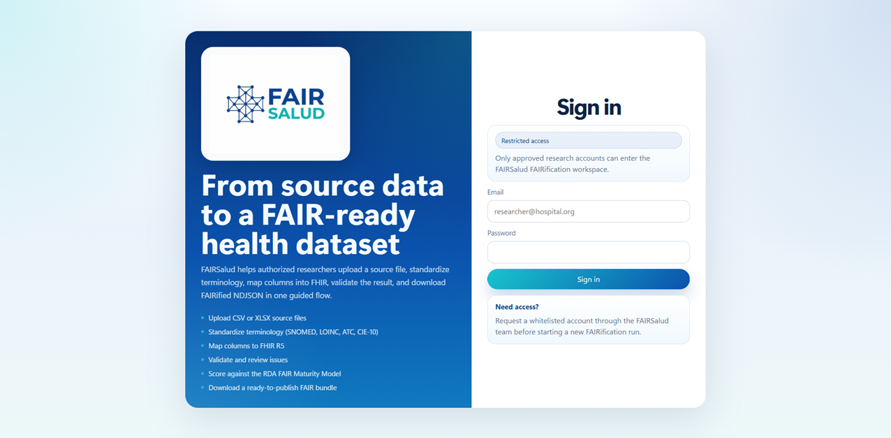

# FAIRSalud Documentation
Official Repo for the Data Curation Tool 2.0 of FAIRSalud project

## Observation Resource Transformation Workflow
This case of use demonstrates how the FAIRSalud platform transforms source data into a FHIR Observation resource through a six-stage workflow:
1. Upload
2. Terminology Service
3. Visual Mapping
4. Validation
5. FAIRness Assessment

The tool is designed as a open-source web-based solution deployable within each federation node, ensuring compliance with data sovereignty and privacy requirements. DCT 2.0 adopts an ephemeral data processing approach when handling Electronic Health Records (EHR) significantly reducing the risk of data breaches while maintaining full functionality within federated environments. However, robust authentication and authorization mechanisms further guarantee confidentiality and integrity, therefore the login page requires whitelist access first for institutions to safely use within their frame.

### Upload

### Terminology Service
### Visual Mapping
### Validation
### Metadata Enrichment
### FAIRness Assessment
