# FAIRSalud Documentation
Official Repo for the Data Curation Tool 2.0 of FAIRSalud project

## Observation Resource Transformation Workflow
This case of use demonstrates how the FAIRSalud platform transforms source data into a FHIR Observation resource through a six-stage workflow covered in five steps:
-> Upload
-> Terminology Service
-> Visual Mapping
-> Validation
-> FAIRness Assessment

### 1. Upload

The FAIRSalud Data Curation Tool (DCT 2.0) is an open-source, web-based solution designed for deployment within federated environments. The platform follows an ephemeral data processing approach when handling Electronic Health Records (EHRs), minimizing data persistence and supporting compliance with data sovereignty and privacy requirements.
Access to the platform is restricted to authorized institutions. Users must authenticate using credentials provided by the FAIRSalud technical support team, ensuring secure access to the FAIRification workspace.

#### FAIRification Workspace

After successful authentication, users are directed to the FAIRification Workspace. The interface is organized around a five-stage workflow that guides the transformation process from source data to FAIR-compliant FHIR resources.
A navigation panel on the left displays the workflow stages and remains visible throughout the process, allowing users to track their progress. The main panel provides contextual information and guidance for each step.

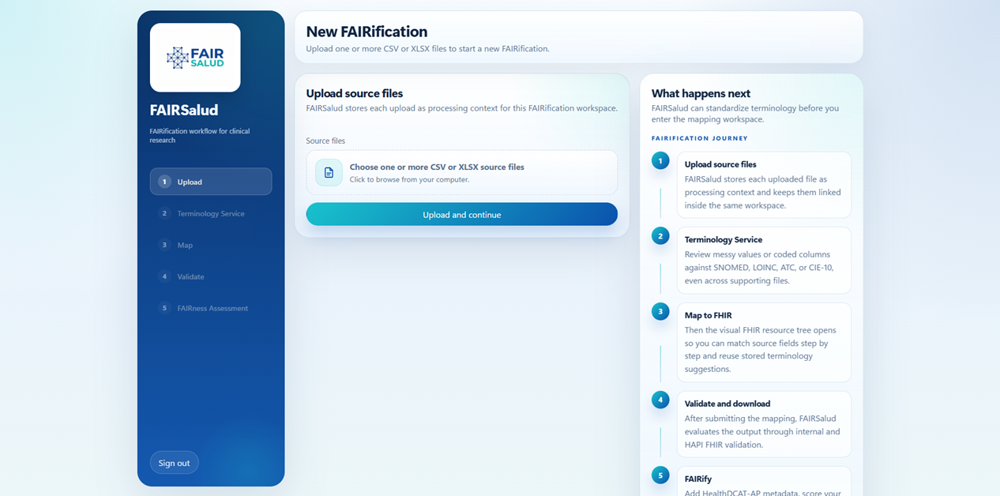

#### Data Upload

The platform supports the ingestion of data from multiple sources, including CSV, XLSX, PostgreSQL databases, and REDCap projects.
In this example, two files are uploaded:
- An XLSX dataset containing clinical information to be transformed into a FHIR Observation resource.
- A CSV file containing ICD-10 codes that will be harmonized with SNOMED CT terminology during the semantic enrichment process.

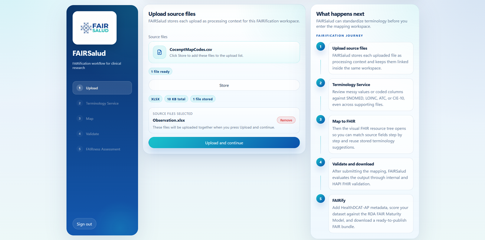

Additional features such as Loading panel in between pages to increase the feeling of dynamic workspace.

#### Workflow Initialization

Once the required files have been provided, the platform processes the uploaded content and prepares the environment for the subsequent FAIRification stages. A loading screen provides feedback on the current operation and ensures a smooth transition between workflow steps.

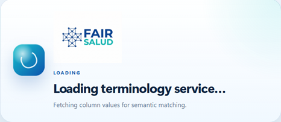

### 2. Terminology Service

When the workspace has been initialized and the source data uploaded, the workflow proceeds to the Terminology Service stage. This component supports semantic harmonization by enabling researchers to align local codes and textual values with standardized terminologies.
To facilitate this process, the platform provides a preview of the uploaded datasets, displaying the first records and the distinct values available for each column. This allows users to inspect the data before performing terminology operations.
In addition to data exploration, the Terminology Service offers several semantic enrichment capabilities, including:
- Code-to-code translation between standard terminologies (ICD-10, LOINC, SNOMED CT, and ATC).
- Text-to-code matching, enabling free-text values to be associated with standardized concepts.
- Terminology lookup and concept exploration to support informed decision-making during the FAIRification process.

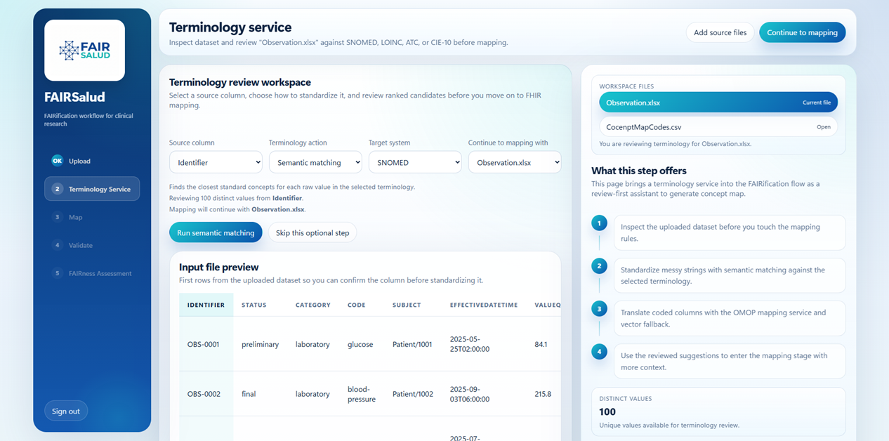

#### Terminology Translation

In this use case, the CSV file containing diagnostic codes is selected and the `icd10_diagnosis` column is chosen as the source field. The **Code Translation** operation is then configured to translate ICD-10 concepts into SNOMED CT concepts.

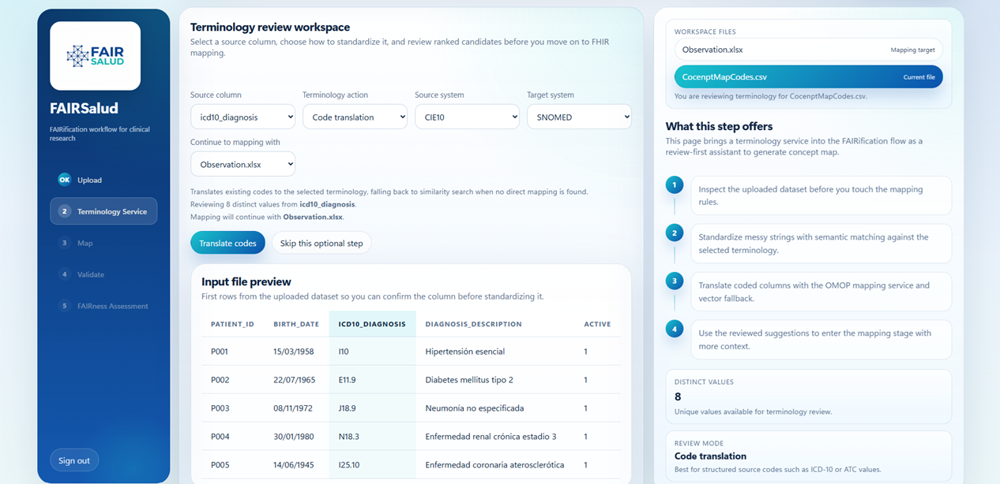

If the configuration is complete, the terminology service is executed and the translation process begins.

#### Reviewing Terminology Suggestions

After the translation has finished, the platform presents the candidate mappings identified for each source code.
In many cases, a single equivalent concept can be identified automatically. However, when multiple candidate concepts are available, user validation is required to determine the most appropriate semantic match. This semi-automated approach combines computational assistance with expert knowledge, improving the quality and reliability of the resulting mappings.

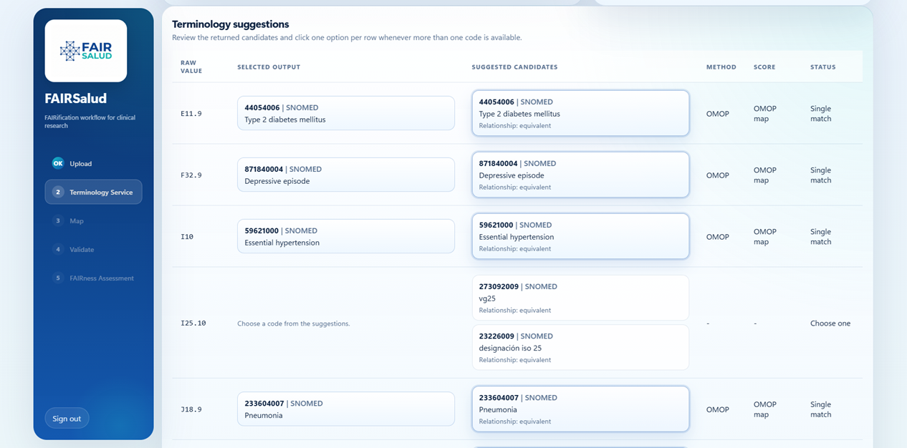

Once the terminology mappings have been reviewed and accepted, the translated concepts can be stored within the working dataset. These harmonized values become available for subsequent workflow stages, ensuring that the mapping process is based on standardized and interoperable terminology.

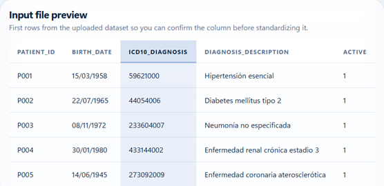

### 3. Visual Mapping

The Visual Mapping stage constitutes the core of the FAIRSalud Data Curation Tool (DCT 2.0). At this stage, the Extract-Transform-Load (ETL) configuration is defined, establishing how source data elements will be transformed into a standards-compliant FHIR resource.
The workspace presents the uploaded datasets alongside a visual mapping environment where users can select the target FHIR resource and define the relationships between source data attributes and FHIR elements.
This is the most important phase given that here is where the Data Curation Tool 2.0 heart lives and the ETL is configured. First thing the researcher sees is the workspace files working with that can be changed anytime and a Visual resource mapper that lets select the FHIR Resource type and shows the source file with its detected columns.

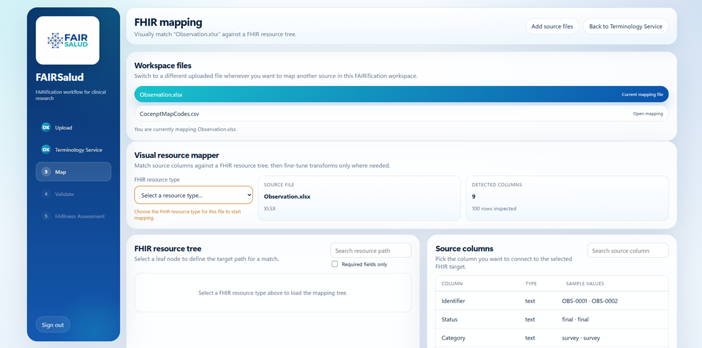

#### Resource Selection

For this use case, the FHIR Observation resource is selected as the target model. The mapping interface is divided into two primary panels:
- The FHIR Resource Tree, displaying the hierarchical structure of the selected FHIR resource.
- The Source Data Panel, displaying the columns detected in the uploaded dataset.
This side-by-side representation allows users to visually associate source attributes with their corresponding FHIR elements.

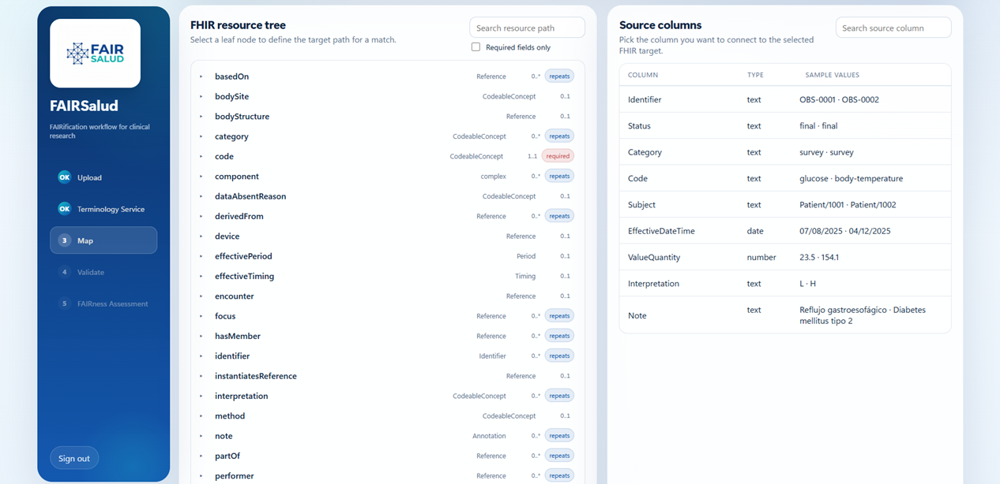

#### Create Mappings

To create a mapping, users select a source column and a target FHIR element. The selected pair is displayed in the mapping panel, where the relationship can be confirmed and stored.
This visual approach simplifies the transformation process while providing immediate feedback regarding the mapping configuration.

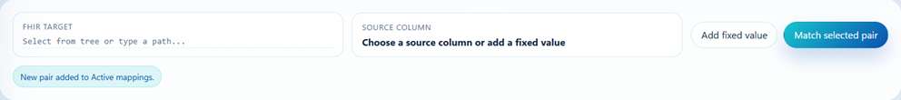

#### Identifying Mandatory Elements

The platform assists users by highlighting mandatory FHIR elements required for resource validity.
For the Observation resource, fields such as `status` and `code` are mandatory and must be mapped before the transformation can be completed successfully.

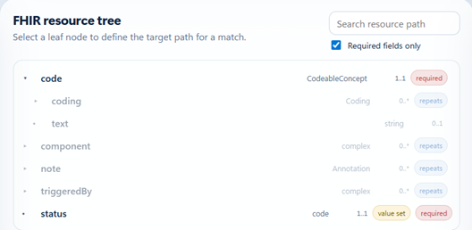

#### Mapping Resource Attributes

As mappings are created, selected source columns and FHIR elements are highlighted within the interface, providing visual guidance throughout the configuration process.
In this example, the source column corresponding to the observation status is associated with the `Observation.status` element.

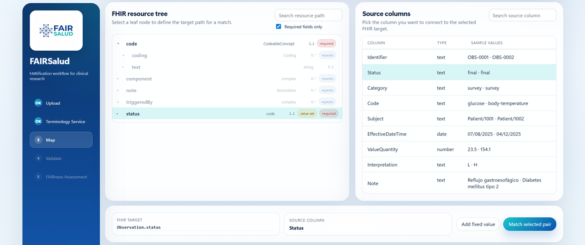

#### Transformation Rules

Not all mappings involve direct value transfers. To support a wide range of transformation scenarios, DCT 2.0 provides an Advanced Rule Editor that allows users to define transformation logic when source and target representations differ.
The platform currently supports nine transformation types:

- Direct Copy – Transfers values without modification.
- Numeric – Handles decimal and numerical conversions.
- Date Format – Supports date normalization and formatting.
- FHIR Reference – Creates references to external FHIR resources.
- Code Map – Maps source values to controlled vocabularies or predefined code sets.
- Boolean Map – Converts source values into boolean representations.
- Concat Fields – Combines multiple source fields into a single target value.
- Split Fields – Divides a source value into multiple target elements.
- Terminology Translation – Integrates terminology harmonization services into the mapping process.

For the Observation resource, the status element requires values conforming to the codes defined by the FHIR specification. Therefore, the Code Map transformer is used to translate source values into the accepted Observation status codes.
The platform continuously informs users about any mandatory elements that remain unmapped, helping ensure the creation of a valid FHIR resource.

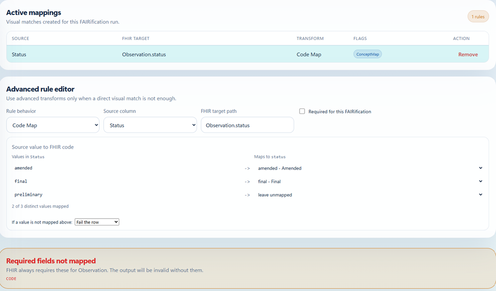

#### Navigation and Search

To facilitate mapping of large and complex resources, the FHIR Resource Tree includes a search capability that allows users to quickly locate specific elements.
This feature significantly accelerates the mapping process when working with resources containing numerous attributes.

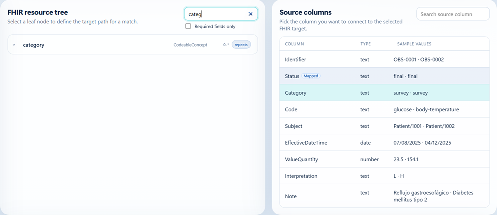

#### Terminology Transformations

The Terminology Translation transformer enables semantic enrichment directly within the mapping workflow and supports three different scenarios:
- Code translation between standard terminologies.
- Semantic matching of textual values to concepts.
- Reuse of terminology suggestions generated during the Terminology Service stage.

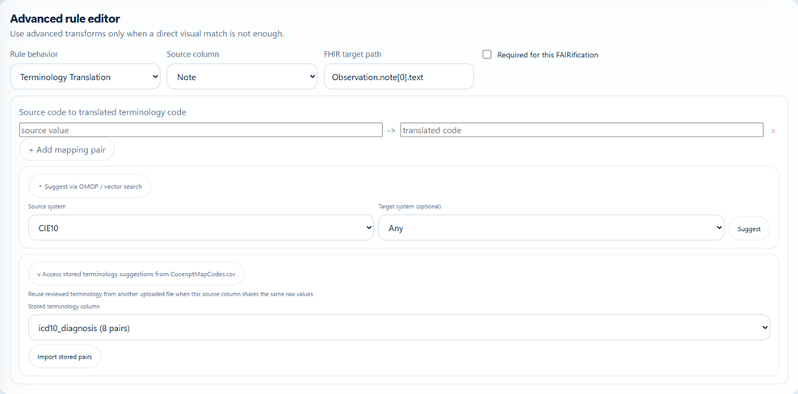

In this use case, the source column containing clinical descriptions is mapped to Observation.note[0].text. The terminology mappings generated during the previous stage are reused to associate these textual descriptions with their corresponding SNOMED CT concepts, ensuring semantic interoperability.

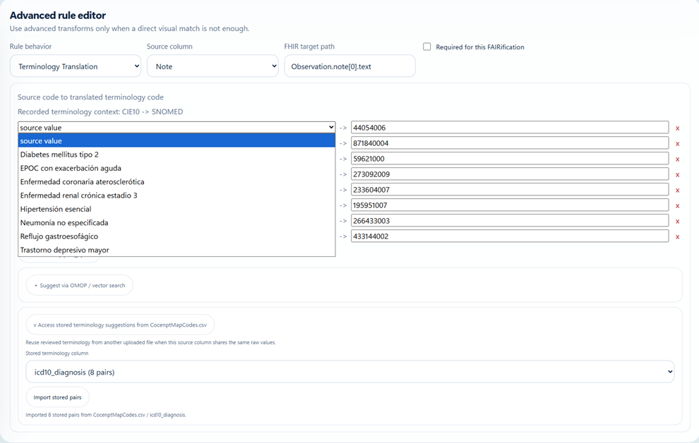

#### Reviewing Mapping Configuration

Before proceeding to validation, users can review all configured mappings through the Active Mappings panel.
This view provides a consolidated overview of source-target relationships, applied transformation rules, and mapping status. Existing mappings can be modified or removed if adjustments are required.

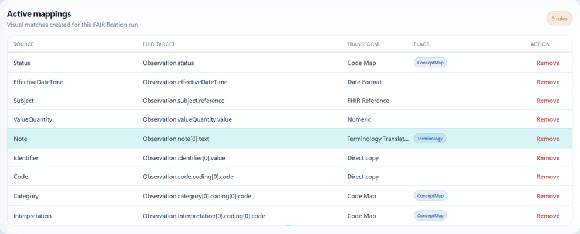

At the end of this stage, the transformation logic required to generate a FHIR Observation resource has been fully defined and is ready for validation.

### Validation

Once the mapping configuration has been completed, the generated resources undergo a validation process to ensure both structural correctness and compliance with FHIR standards. DCT 2.0 implements a two-layer validation strategy:

- Internal Validation: verifies the consistency of the mapping configuration, transformation rules, and generated resources.
- HAPI FHIR Validation: wevaluates the generated resources against the FHIR specification and applicable conformance rules.

This combined approach helps identify potential issues before the resources are used in downstream systems or research workflows.

#### Validation Progress

During execution, the platform provides real-time feedback through a progress indicator, allowing users to monitor the validation process.
In addition to tracking progress, the validation interface presents a dynamic report containing detailed information about the generated resources, including:

Validation errors that must be resolved.
Warnings that may require further review.
Records that have been skipped during the transformation process.
Summary statistics regarding the validation outcome.

This information enables researchers to quickly identify and address potential quality issues before proceeding to the final FAIRification stage.

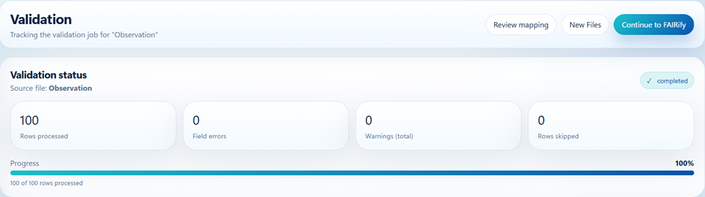

#### Validation Results

After all generated resources have been successfully evaluated, the platform displays a completion message summarizing the outcome of the validation process.

At this point, the transformed data conforms to the expected FHIR structure and is ready for FAIRness assessment. While validation ensures technical interoperability and standards compliance, the final stage focuses on evaluating the resulting assets against the FAIR principles, providing insight into their readiness for data sharing, reuse, and secondary research applications.

### FAIRness Assessment
